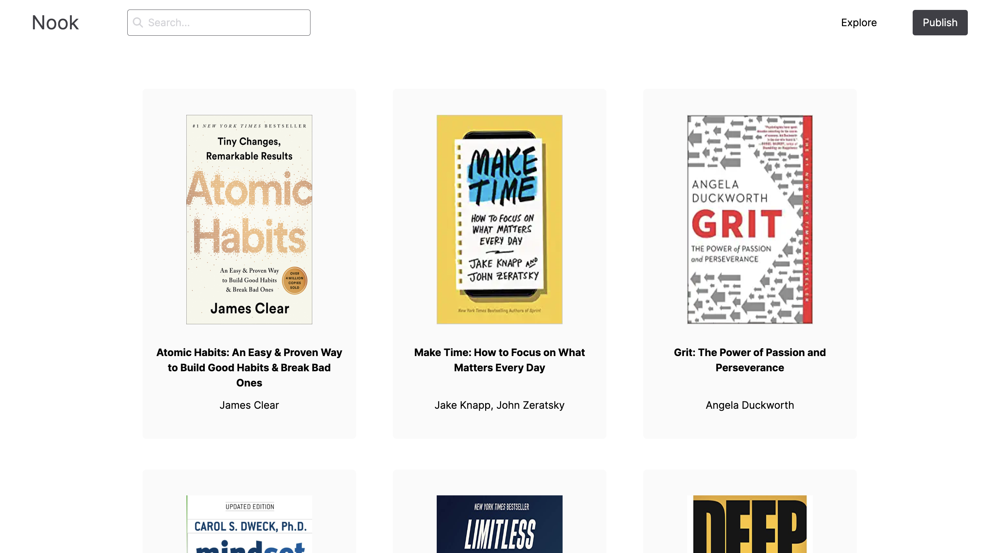
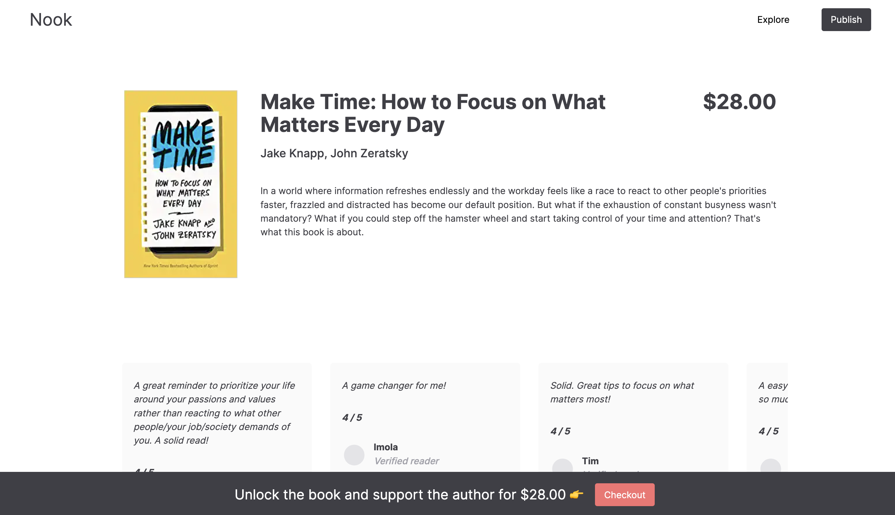
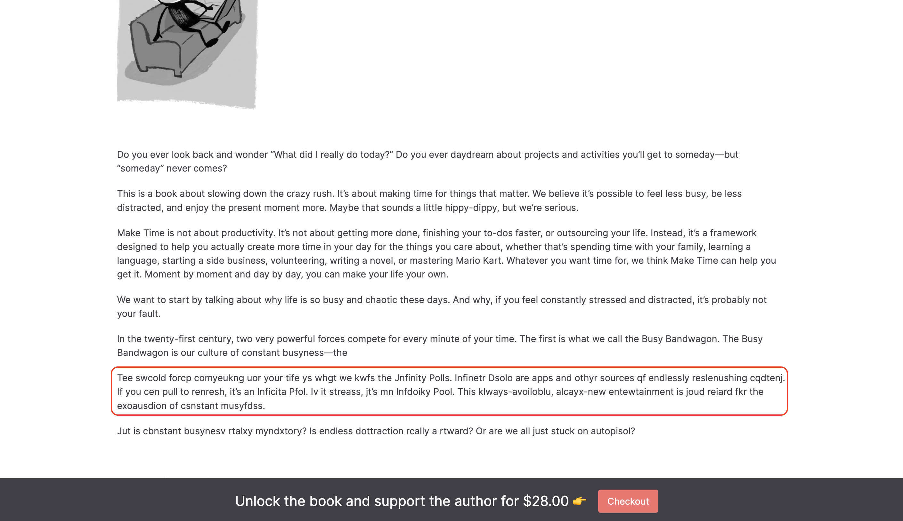

# Nook

Nook is a site for indie writers to publish their books and get paid for their work. Nook will show a short snippet of the book and gradually obfuscate the contents. Readers purchase the book to unlock the rest of the content and show their support for their favourite writers. Writers will host their book contents on Notion and Nook uses the Notion API to fetch the book contents to display on site.

This repository is for the backend. You may find the frontend repository [HERE](https://github.com/awhuiyun/nook).

